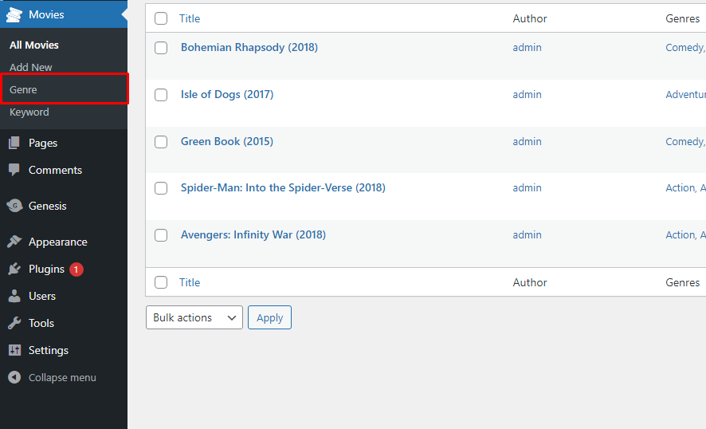
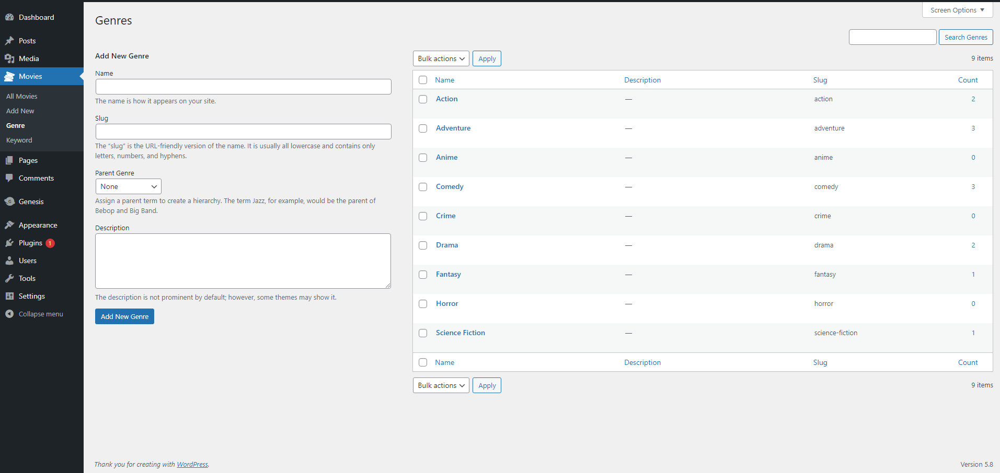
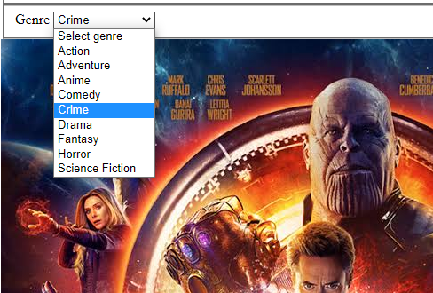

<p align="center"></p>

<p align="center">
  <h3 align="center">Wordpress Taxonomy</h3>
  <p align="center">
    Simple snippet to create taxonomy and how to retrieve the taxonomy term values from database
    <br />
    <br />
    <br />
    <a href="https://github.com/jmguevarra/wordpress-simple-snippets/issues">Report Bug</a>
    ·
    <a href="https://github.com/jmguevarra/wordpress-simple-snippets/issues">Request Feature</a>
  </p>
</p>


<!-- TABLE OF CONTENTS -->
<details open="open">
  <summary>Table of Contents</summary>
  <ol>
    <li>
      <a href="#about-the-project">About The Snippet</a>
    </li>
    <li>
      <a href="#getting-started">Getting Started</a>
      <ul>
        <li><a href="#installation">Installation</a></li>
        <li><a href="#usage">Usage</a></li>
        <li><a href="#usage">Fetch Taxonomy from Database</a></li>
      </ul>
    </li>
    <li><a href="#roadmap">Roadmap</a></li>
    <li><a href="#contribution">Contribution</a></li>
    <li><a href="#contact">Contact</a></li>
  </ol>
</details>


<!-- ABOUT THE PROJECT -->
## About The Project

Taxonomy in wordpress is feature that you can add for specific categories of you post type. In the given example I made genre as categories of movies.


<!-- GETTING STARTED -->
## Getting Started
To initiate this kind of tab in wordpress post type you need to call register_taxonomy_genre. _See full [documentation](https://developer.wordpress.org/reference/functions/register_taxonomy/)_

```php
/**
 * Create Custom Taxonomy
 * Functions: register_taxonomy, init
 */
function register_taxonomy_genre() {
    $labels = [
    'name'              => _x('Genres', 'taxonomy general name'),
    'singular_name'     => _x('Genre', 'taxonomy singular name'),
    'search_items'      => __('Search Genres'),
    'all_items'         => __('All Genres'),
    'parent_item'       => __('Parent Genre'),
    'parent_item_colon' => __('Parent Genre:'),
    'edit_item'         => __('Edit Genre'),
    'update_item'       => __('Update Genre'),
    'add_new_item'      => __('Add New Genre'),
    'new_item_name'     => __('New Genre Name'),
    'menu_name'         => __('Genre'),
    ];
    $args = [
    'hierarchical'      => true, // make it hierarchical (like categories)
    'labels'            => $labels,
    'show_ui'           => true,
    'show_admin_column' => true,
    'query_var'         => true,
    'rewrite'           => ['slug' => 'genre'],
    ];
    register_taxonomy('genre', ['movie'], $args);
}
add_action('init', 'register_taxonomy_genre');  //load it to wordpress init function
```

<!-- Installation -->
### Installation

1. Goto you functions.php 
2. Create your own function name for me its register_taxonomy_genre(). <a href="##getting-started">see above</a>
  ```php
  function register_taxonomy_genre() {
    //code here
  }
  ```
3. Inside of it you need to call the wordpress function - register_taxonomy() and it has arguements for setting and labels. The below example is just basic setting for taxonomy. _check here for [documentation](https://developer.wordpress.org/reference/functions/register_taxonomy/)_
  ```php
    $labels = [
    'name'              => _x('Genres', 'taxonomy general name'),
    'singular_name'     => _x('Genre', 'taxonomy singular name'),
    'search_items'      => __('Search Genres'),
    'all_items'         => __('All Genres'),
    'parent_item'       => __('Parent Genre'),
    'parent_item_colon' => __('Parent Genre:'),
    'edit_item'         => __('Edit Genre'),
    'update_item'       => __('Update Genre'),
    'add_new_item'      => __('Add New Genre'),
    'new_item_name'     => __('New Genre Name'),
    'menu_name'         => __('Genre'),
    ];
    $args = [
    'hierarchical'      => true, // make it hierarchical (like categories)
    'labels'            => $labels,
    'show_ui'           => true,
    'show_admin_column' => true,
    'query_var'         => true,
    'rewrite'           => ['slug' => 'genre'],
    ];

    register_taxonomy('genre', ['movie'], $args);

    /** 3 arguements
     * genre - as taxonomy id
     * [movies] - arrays of post type object. For me its movies so this genre taxonmy will add in Custom Post Type of Movie
     * $args - its array variable for custom taxonomy settings
     */
  ```

4. add your register_taxonomy_genre() function to wordpress init to load it and its done.
  ```php
    add_action('init', 'register_taxonomy_genre');  //load it to wordpress init function
  ```

Result:
<p align="center"></p>


<!-- Usage  -->
### Usage
To add new category/genre just click the genre. Then fill out the text fields.

<p align="center"></p>


<!-- Fetch Taxonomy  -->
### Fetch Taxonomy from Database
<p align="center"></p>

To fetch the taxonomy from database you need to call get_terms() function of wordpress. see example below:
```php
  <fieldset data-movie-form="group single-line">
  <label data-movie-form="main-label" for="movie-title">Genre</label>

    <?php 
        //retreiving values for custom taxonomies/category
        $genres = get_terms( array(
            'taxonomy' => 'genre',
            'hide_empty' => false,
        ));
    ?>

  <select data-css-form="input select" id="movie-genre" name="movie-genre">
    <option>Select Genre</option>
    <?php 
        //Loop the different Genre/Taxonomies Term
        foreach($genres as $genre) : ?>
        <option value="<?= $genre->term_id; ?>"><?= $genre->name; ?></option>
    <?php endforeach; ?>
  </select>
</fieldset>
```

<!-- ROADMAP -->
## Roadmap

See the [open issues](https://github.com/jmguevarra/wordpress-simple-snippets/issues) for a list of proposed features (and known issues).


<!-- CONTRIBUTING -->
## Contributing

Contributions are what make the open source community such an amazing place to be learn, inspire, and create. Any contributions you make are **greatly appreciated**.

1. Fork the Project
2. Create your Feature Branch (`git checkout -b feature/AmazingFeature`)
3. Commit your Changes (`git commit -m 'Add some AmazingFeature'`)
4. Push to the Branch (`git push origin feature/AmazingFeature`)
5. Open a Pull Request


<!-- CONTACT -->
## Contact

Facebook: [JM Guevarra](https://www.facebook.com/JM.Guevarra22)<br>
Upwork: [Jaime G.](https://www.upwork.com/freelancers/~019dfd9fd872ed6675)<br>
OnlineJobsPH: [Jaime Guevarra Jr](https://www.onlinejobs.ph/jobseekers/info/1524593)<br>
Skype ID: [live: jaimeguevarra22](https://web.skype.com/)<br>
Email: [jaimeguevarra22@gmail.com](mailto:jaimeguevarra22@gmail.com)<br>
Number: [09125213454]

Repository Link: [https://github.com/jmguevarra/wordpress-simple-snippets/](https://github.com/jmguevarra/wordpress-simple-snippets/)


